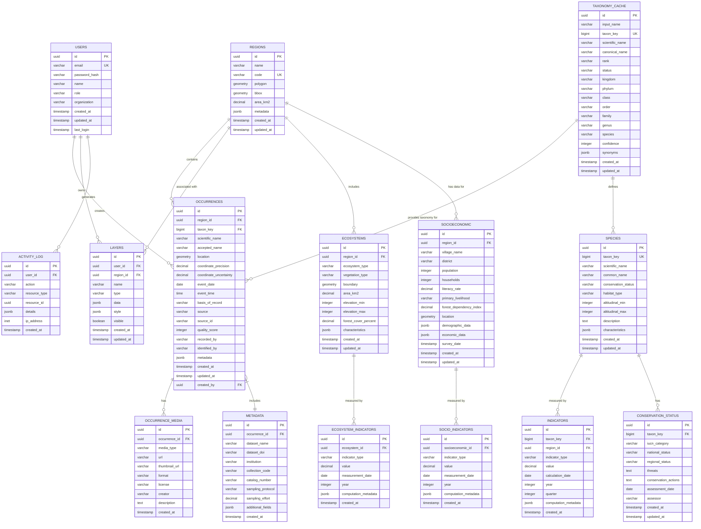

# Database Schema Overview - Entity Relationship Diagram

## Visual Diagram



## Schema Description

### Core Domain Tables

#### 1. **USERS**
**Purpose**: User authentication and authorization

**Key Fields**:
- `role`: 'public', 'researcher', 'curator', 'admin'
- `organization`: Institution affiliation
- `last_login`: Track active users

**Relationships**:
- Creates occurrences (data contributions)
- Owns custom layers (personal visualizations)
- Generates activity logs (audit trail)

---

#### 2. **REGIONS**
**Purpose**: Geographic boundaries for Eastern Himalaya sub-regions

**Key Fields**:
- `polygon`: Boundary geometry (PostGIS)
- `bbox`: Bounding box for quick spatial queries
- `area_km2`: Pre-calculated area
- `metadata`: Additional region characteristics (JSON)

**Examples**:
- Sikkim (7,096 km²)
- Darjeeling (3,149 km²)
- Eastern Bhutan (38,394 km²)

**Relationships**:
- Contains occurrences (1:Many)
- Associated with ecosystems (1:Many)
- Has socioeconomic data (1:Many)

---

#### 3. **TAXONOMY_CACHE**
**Purpose**: Local cache of GBIF taxonomy for fast lookups

**Key Fields**:
- `taxon_key`: GBIF unique identifier
- `scientific_name`: Full Latin binomial
- `status`: 'ACCEPTED', 'SYNONYM', 'DOUBTFUL'
- `synonyms`: Alternative names (JSON array)

**Usage**:
- Resolve user-provided names to accepted taxonomy
- Avoid repeated GBIF API calls
- Support offline taxonomy matching

---

#### 4. **SPECIES**
**Purpose**: Extended species information beyond GBIF

**Key Fields**:
- `conservation_status`: IUCN category
- `altitudinal_min/max`: Elevation range (meters)
- `habitat_type`: Forest type preference
- `characteristics`: Ecological traits (JSON)

**Relationships**:
- Linked to taxonomy cache via `taxon_key`
- Has conservation status records
- Measured by indicators (SMI, SDI, SHI)

---

### Biodiversity Data Tables

#### 5. **OCCURRENCES** (Primary biodiversity data)
**Purpose**: Species observation records

**Key Fields**:
- `location`: Point geometry (PostGIS GEOGRAPHY)
- `coordinate_precision`: Decimal degrees (e.g., 0.0001)
- `quality_score`: 0-100 data quality rating
- `basis_of_record`: 'HUMAN_OBSERVATION', 'MACHINE_OBSERVATION', 'PRESERVED_SPECIMEN'

**Partitioning Strategy**:
```sql
-- Partitioned by region for query performance
CREATE TABLE occurrences_sikkim PARTITION OF occurrences
    FOR VALUES IN ('region-sikkim-uuid');
```

**Indexes**:
- Spatial index: `GIST(location)`
- Taxon index: `BTREE(taxon_key)`
- Date index: `BTREE(event_date)`
- Quality index: `BTREE(quality_score)`

---

#### 6. **OCCURRENCE_MEDIA**
**Purpose**: Photos, audio, and videos linked to occurrences

**Key Fields**:
- `media_type`: 'image', 'sound', 'video'
- `url`: Link to media file (S3 or external)
- `license`: 'CC0', 'CC-BY', 'CC-BY-SA', 'CC-BY-NC'

**Use Cases**:
- Species identification verification
- Phenology observations (flowering, fruiting)
- Behavioral documentation

---

#### 7. **METADATA**
**Purpose**: Darwin Core extended metadata

**Key Fields**:
- `dataset_name`: Source dataset identifier
- `sampling_protocol`: Collection methodology
- `sampling_effort`: Person-hours, trap-nights
- `additional_fields`: Custom metadata (JSON)

---

### Ecosystem Tables

#### 8. **ECOSYSTEMS**
**Purpose**: Ecosystem type mapping and characteristics

**Key Fields**:
- `ecosystem_type`: 'Temperate Forest', 'Alpine Meadow', 'Sub-tropical Forest'
- `vegetation_type`: Dominant plant communities
- `forest_cover_percent`: Tree canopy percentage
- `boundary`: Polygon geometry

**Relationships**:
- Belongs to region (Many:1)
- Has ecosystem indicators (1:Many)

---

#### 9. **ECOSYSTEM_INDICATORS**
**Purpose**: Ecosystem health and change metrics

**Indicator Types**:
- `NDVI`: Normalized Difference Vegetation Index
- `FOREST_COVER_CHANGE`: Annual forest loss/gain
- `CARBON_STOCK`: Estimated carbon storage
- `BIODIVERSITY_INTACTNESS`: BII score

---

### Socioeconomic Tables

#### 10. **SOCIOECONOMIC**
**Purpose**: Village-level demographic and economic data

**Key Fields**:
- `forest_dependency_index`: 0-1 scale of forest reliance
- `primary_livelihood`: 'Agriculture', 'Tourism', 'Forestry'
- `demographic_data`: Age structure, education (JSON)
- `economic_data`: Income sources, expenditures (JSON)

**Data Sources**:
- Census surveys
- Household interviews
- Participatory assessments

---

#### 11. **SOCIO_INDICATORS**
**Purpose**: Socioeconomic change indicators

**Indicator Types**:
- `LIVELIHOOD_DIVERSITY`: Number of income sources
- `FOREST_USE_INTENSITY`: Resource extraction rate
- `ECONOMIC_WELLBEING`: Composite prosperity index
- `MIGRATION_RATE`: Population movement

---

### Indicator Tables

#### 12. **INDICATORS** (Species-level)
**Purpose**: Computed biodiversity change metrics

**Indicator Types**:

**SMI (Species Monitoring Index)**:
- Measures observation frequency trends
- Baseline vs. recent comparison
- Alerts on declining species

**SDI (Species Distribution Index)**:
- Habitat occupancy percentage
- Elevation range shifts
- Ecosystem-specific presence

**SHI (Species Health Index)**:
- Combines IUCN status, trends, threats
- Weighted composite score
- Early warning system

**Computation Metadata**:
```json
{
  "computation_date": "2025-11-06",
  "baseline_period": "2015-2019",
  "recent_period": "2020-2024",
  "observation_count": 1250,
  "confidence_level": 0.85
}
```

---

#### 13. **CONSERVATION_STATUS**
**Purpose**: Multi-scale threat assessment

**Key Fields**:
- `iucn_category`: 'CR', 'EN', 'VU', 'NT', 'LC'
- `national_status`: India-specific assessment
- `regional_status`: Eastern Himalaya assessment
- `threats`: Habitat loss, climate change, poaching

---

### Application Tables

#### 14. **LAYERS**
**Purpose**: User-created custom map layers

**Layer Types**:
- `occurrence_filter`: Filtered species observations
- `heatmap`: Density visualization
- `custom_polygon`: User-drawn areas of interest
- `story_map`: Narrative-driven visualization

**Example**:
```json
{
  "type": "occurrence_filter",
  "filters": {
    "taxonKey": 5218933,
    "dateRange": ["2020-01-01", "2024-12-31"],
    "qualityThreshold": 70
  }
}
```

---

#### 15. **ACTIVITY_LOG**
**Purpose**: Audit trail and usage analytics

**Tracked Actions**:
- `USER_LOGIN`, `DATA_UPLOAD`, `EXPORT_REQUEST`
- `LAYER_CREATE`, `FILTER_APPLY`, `MAP_VIEW`

**Analytics Use Cases**:
- Popular species searches
- Most accessed regions
- Peak usage times
- Data contribution patterns

---

## Data Domain Relationships

### Species Domain
```
TAXONOMY_CACHE → SPECIES → OCCURRENCES → INDICATORS
                    ↓
            CONSERVATION_STATUS
```

**Flow**: Taxonomy defines species → Species have occurrences → Occurrences compute indicators → Status tracks threats

---

### Ecosystem Domain
```
REGIONS → ECOSYSTEMS → ECOSYSTEM_INDICATORS
            ↓
        OCCURRENCES (spatial join)
```

**Flow**: Regions contain ecosystems → Ecosystems measured by indicators → Occurrences linked via spatial query

---

### Socioeconomic Domain
```
REGIONS → SOCIOECONOMIC → SOCIO_INDICATORS
```

**Flow**: Regions have villages → Villages surveyed for socioeconomic data → Indicators track changes

---

### Indicators of Change (IoC) Domain
```
SPECIES + ECOSYSTEMS + SOCIOECONOMIC
            ↓
    INTEGRATED INDICATORS
            ↓
      CHANGE ALERTS
```

**Integration**: Combine biodiversity, ecosystem, and human dimensions for holistic monitoring

---

## Indexing Strategy

### Spatial Indexes (PostGIS GIST)
```sql
-- Occurrence locations
CREATE INDEX idx_occurrences_location 
    ON occurrences USING GIST(location);

-- Region boundaries
CREATE INDEX idx_regions_polygon 
    ON regions USING GIST(polygon);

-- Ecosystem boundaries
CREATE INDEX idx_ecosystems_boundary 
    ON ecosystems USING GIST(boundary);
```

### Attribute Indexes (B-Tree)
```sql
-- Frequent lookup fields
CREATE INDEX idx_occurrences_taxon ON occurrences(taxon_key);
CREATE INDEX idx_occurrences_region ON occurrences(region_id);
CREATE INDEX idx_occurrences_date ON occurrences(event_date);
CREATE INDEX idx_occurrences_quality ON occurrences(quality_score);
CREATE INDEX idx_occurrences_source ON occurrences(source);
```

### Full-Text Search Indexes (GIN)
```sql
-- Scientific name search
CREATE INDEX idx_occurrences_name 
    ON occurrences USING GIN(scientific_name gin_trgm_ops);

-- Common name search
CREATE INDEX idx_species_common 
    ON species USING GIN(common_name gin_trgm_ops);
```

---

## Data Integrity Constraints

### Foreign Key Constraints
```sql
-- Ensure referential integrity
ALTER TABLE occurrences
    ADD CONSTRAINT fk_occurrences_region
    FOREIGN KEY (region_id) REFERENCES regions(id)
    ON DELETE CASCADE;

ALTER TABLE occurrences
    ADD CONSTRAINT fk_occurrences_taxon
    FOREIGN KEY (taxon_key) REFERENCES taxonomy_cache(taxon_key)
    ON DELETE RESTRICT;
```

### Check Constraints
```sql
-- Data quality rules
ALTER TABLE occurrences
    ADD CONSTRAINT check_quality_score
    CHECK (quality_score >= 0 AND quality_score <= 100);

ALTER TABLE occurrences
    ADD CONSTRAINT check_coordinates
    CHECK (
        ST_X(location) BETWEEN 87 AND 95 AND
        ST_Y(location) BETWEEN 26 AND 29
    );
```

---

## Sample Queries

### 1. Find all red panda observations in Sikkim
```sql
SELECT 
    o.id,
    o.scientific_name,
    ST_X(o.location) AS longitude,
    ST_Y(o.location) AS latitude,
    o.event_date,
    o.quality_score
FROM occurrences o
JOIN regions r ON o.region_id = r.id
WHERE o.taxon_key = 5218933  -- Ailurus fulgens
  AND r.code = 'SKM'
  AND o.quality_score >= 70
ORDER BY o.event_date DESC;
```

### 2. Calculate species richness by region
```sql
SELECT 
    r.name AS region_name,
    COUNT(DISTINCT o.taxon_key) AS species_count,
    COUNT(o.id) AS occurrence_count
FROM regions r
LEFT JOIN occurrences o ON r.id = o.region_id
GROUP BY r.id, r.name
ORDER BY species_count DESC;
```

### 3. Compute Species Monitoring Index (SMI)
```sql
WITH recent AS (
    SELECT taxon_key, COUNT(*) AS recent_count
    FROM occurrences
    WHERE event_date >= '2020-01-01'
    GROUP BY taxon_key
),
baseline AS (
    SELECT taxon_key, COUNT(*) AS baseline_count
    FROM occurrences
    WHERE event_date BETWEEN '2015-01-01' AND '2019-12-31'
    GROUP BY taxon_key
)
SELECT 
    t.scientific_name,
    r.recent_count,
    b.baseline_count,
    ROUND((r.recent_count::numeric / NULLIF(b.baseline_count, 0)) * 100, 2) AS smi
FROM recent r
JOIN baseline b ON r.taxon_key = b.taxon_key
JOIN taxonomy_cache t ON r.taxon_key = t.taxon_key
ORDER BY smi DESC;
```

### 4. Find ecosystems with declining forest cover
```sql
SELECT 
    e.ecosystem_type,
    ei_old.value AS forest_cover_2015,
    ei_new.value AS forest_cover_2024,
    (ei_new.value - ei_old.value) AS change_percent
FROM ecosystems e
JOIN ecosystem_indicators ei_old 
    ON e.id = ei_old.ecosystem_id
    AND ei_old.indicator_type = 'FOREST_COVER_CHANGE'
    AND ei_old.year = 2015
JOIN ecosystem_indicators ei_new 
    ON e.id = ei_new.ecosystem_id
    AND ei_new.indicator_type = 'FOREST_COVER_CHANGE'
    AND ei_new.year = 2024
WHERE (ei_new.value - ei_old.value) < -5  -- 5% decline threshold
ORDER BY change_percent ASC;
```

---

## Scalability Considerations

### Partitioning Strategy
- **Occurrences**: Partition by `region_id` (5-10 partitions)
- **Indicators**: Partition by `year` (annual partitions)
- **Activity Log**: Partition by `created_at` (monthly partitions)

### Archival Strategy
- Move occurrences >10 years old to archive table
- Compress old indicator computations
- Retain metadata for all records

### Backup Strategy
- Daily incremental backups
- Weekly full backups
- Point-in-time recovery enabled
- Geographic replication for disaster recovery

---

**Export Instructions**:
```bash
# Generate ER Diagram
mmdc -i 03_database_schema.md -o database_schema.svg -t neutral -b transparent
mmdc -i 03_database_schema.md -o database_schema.png -t neutral -w 3000 -H 2400
```

---

**Document**: Database Schema - Entity Relationship Diagram  
**Version**: 1.0  
**Date**: November 6, 2025  
**Database**: PostgreSQL 15 + PostGIS 3.4  
**Standards**: Darwin Core, ISO 19115
